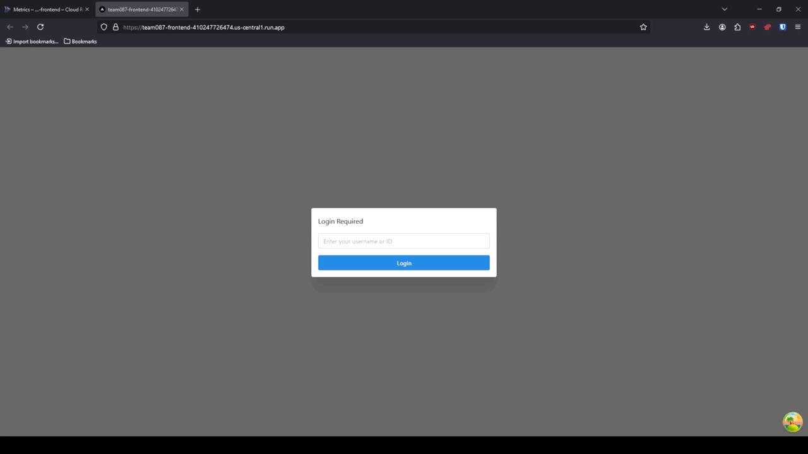

# Project Overview
---

This project is a web application completed for UIUC's CS 411 Database Systems course designed to provide users an easy way to interact with information provided by the US Department of Transportation and Department of Energy about electric vehicle charging stations. This functionality can be used to plan trips within and between cities with electric vehicles. In addition to trip planning, we provide users with intuitive ways to view traffic congestion around popular charging stations, and enable users to get high-level information about the types and costs of charging ports in their area. 

The entire project is centered around a MySQL database designed by our team which holds critical data needed for the project like raw EV charging station information, types of electric vehicles, and sample user data. The main functionality of our web application is powered by a variety of advanced SQL queries that can be found in our backend queries. 

> [!NOTE]
> **Accessing this project**
> 
> The frontend for this project is accessible from the following URL:
> https://team087-frontend-410247726474.us-central1.run.app
> 
> Please note this project is being hosted using free GCP credits provided by UIUC for CS 411. It may or may not still be accessible depending on how many credits remain, as paying for the deployment costs would be expensive for us over time.
> 
> Also note that the database is freely available for anyone to edit. Feel free to interact with it through our frontend, but please be courteous to others who may want to look at it in the future.

All data related to charging stations and traffic volumes is publicly available from the US Department of Transportation and the US Department of Energy which was cleaned and transformed to fit our needs for this project. User data is not real and was all generated. 

Raw EV charging stations data: 
https://afdc.energy.gov/fuels/electricity-locations#/find/nearest?fuel=ELEC

Raw traffic data:
https://www.fhwa.dot.gov/policyinformation/tables/tmasdata/

# Demos
---
## Logging in


- Once you access the frontend, you can log in as any user. Logging in using either a user ID or a user name. There are ~10000 user IDs in numerical order, but we use `1` here for demonstration purposes.

## Editing an Electric Vehicle's stats

- Showing full CRUD functionality by editing one of the database's electric vehicle records. New EVs can be added, edited, or removed as necessary.

## Finding Compatible Stations


- When logged in as user 1, we can double click to update the current latitude and longitude (to Las Vegas in this case) and search 20km around that location for compatible EV charging stations for any vehicle tied to this user's account.
- We can examine each charging station to see additional information about how many charging ports are available, their estimated charging costs, and whether they are in use or not based on their color. By default, we sort these charging stations from cheapest to most expensive with the shade of the color showing how expensive it is.

## Viewing Traffic Congestion


- An example of viewing traffic congestion in Las Vegas around all charging stations. Red areas indicate more congestion and likely higher charge wait times and costs. Heatmap parameters can be adjusted as needed to provide users with the ability to adjust thresholds and spot sizes.

## Finding Best EV for a Trip


- We can find the cheapest EVs for a trip in 2 cities by moving the pins to places of interest. The search button will compare all EV charging station prices around both pins, and provide the cheapest EVs that can operate in those areas. Some stations are free to charge in, hence why they appear at the top of the list with a cost of 0.

## Getting Charging Statistics for a City


- You can search a city to get a list of the count, average base price, and usage prices of all charging stations in an area. This is useful for finding which cities have the most chargers available for any given plug type.


# Database Schema
---

One of the primary focuses for the project was the database itself. We fully constructed a new database schema and populated it with publicly available (or synthesized) data and hosted it on a GCP MySQL server. An ER diagram of our final database schema can be seen here. For more information about the decisions made during development, please see the `docs` folder which contains incremental reports as the project progressed.


- The final database schema. 

# How to Run Locally
---

Our backend database is hosted on GCP and is required for the overall functionality of the app. If the backend database is down (due to us running out of free credits) you can always host your own MySQL database locally or through GCP. Connection parameters for the database server can be modified in `app/backend/evproject-backend/src/db_connection.py`. To run the backend service, navigate to `app/backend/evproject-backend/src` and run:

```
uvicorn src.main:app --host 0.0.0.0 --port 8080
```

You can then navigate to to the provided URL displayed in the console to see the API endpoints and interact with them once connected to the database.

To run the frontend locally, navigate to `app/frontend/tea,087-frontend`, install the Node dependencies, and run with:

```
npm run dev
```

For more information about running and deploying the front or backend, refer to the separate READMEs in the respective `app` directories.
